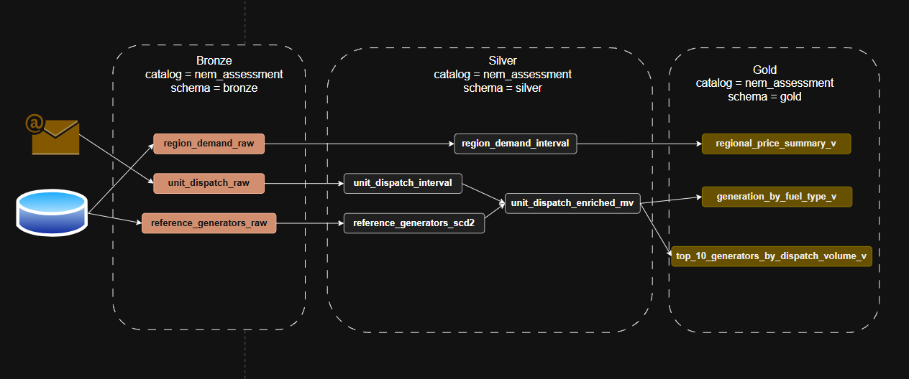

# Data Pipeline Solution – NEM Data Ingestion & Processing

## Overview
Data model and data pipeline for ingesting, transforming, and analysing Australian energy market dispatch data.
This solution leverages a modern data engineering stack consisting of:

- **Databricks**
- **Python / PySpark**
- **Azure Data Lake Storage (ADLS)**
- **Delta Lake**

The design aligns with typical Azure-based data platforms and assumes:
- Databricks is configured with a **registered Service Principal in Azure**
- Email ingestion is performed via **Microsoft Outlook**, using the **Microsoft Graph API**

---

## Part 1 - Pipeline Architecture Summary

- To ingest daily files received via email, a scheduled Databricks Workflow job can perform a `GET` request to the **Microsoft Graph API** which will locate the email using sender + date filters and retrieve the attachments using expected file name. The attachments can then be uploaded to Azure Data Lake raw folder using Azure SDK methods.

- AEMO data on regional demand and unit dispatch data can be stored in ADLS using a **date-partitioned structure**: raw/aemo/unit_dispatch/YYYY/MM/DD/raw_unit_dispatch.csv. The partitioning will help with lifecycle management (e.g. different tiering by year) and observability. These files are ingested into a bronze delta table which has minimal change except for a derived ingestion_date column. When processing into silver, data will be cleaned and although not detected in this dataset null values may be excluded and duplicates removed. Two silver tables are joined in the materilized view unit_dispatch_enriched_mv to prevent re-execution of joins in upstream reports and queries by analysts. The cleaned silver tables are then aggregated into report-ready views in the gold layer, which can directly connect to BI reports.

- A pipeline will copy the full reference generators data into ADLS raw folder on schedule, each time overwriting the previous CSV. It is ingested into reference_generators_raw. In order to maintain a slowly chaning dimension type 2, the silver layer table will have columns "effective_from" and "effective_to". A pipeline will merge from raw, inserting new rows, closing off rows using "effective_to" and inserting new rows for updated rows, and closing off rows if some rows were deleted in the source. 

## Part 2 - Data Model

The pipeline follows a medallion architecture with bronze for raw ingestion, silver for cleaned and enriched data, and gold for report-ready aggregations. The central silver table is unit_dispatch_enriched_mv, which pre-joins the 5-minute dispatch fact (unit_dispatch_interval) with generator reference attributes (reference_generators_scd2) using a point-in-time SCD2 join — meaning every downstream gold view gets fuel type, owner, station name, and registered capacity without needing to perform any joins itself. Each of the three gold views maps directly to one report question with no additional transformation required at query time. 

**region_demand_raw** (Bronze)
- Grain: One row per (interval_datetime, region_id).
- Partitioned by derived column ingestion_date to enable efficient incremental processing. 
- interval_datetime is set as string for safer landing. 

**unit_dispatch_raw** (Bronze)
- Grain: One row per (interval_datetime, duid).
- Partitioned by derived column ingestion_date to enable efficient incremental processing to silver layer.
- interval_datetime is set as string for safer landing. 

**reference_generators_raw** (Bronze)
- Grain: One row per duid
- No partition required as it is a small reference table. 

**region_demand_interval** (Silver)
- Grain: One row per (interval_datetime, region_id).
- Partitioned by derived column dispatch_date to help with efficient querying of dispatch data.

**unit_dispatch_interval** (Silver)
- Grain: One row per (interval_datetime, duid).
- Partitioned by derived column dispatch_date to help with efficient querying of dispatch data.

**reference_generators_scd2** (Silver)
- Grain: One row per (duid, effective_from) — representing a generator's attributes for a specific time window.
- No partitioning required as it is a small reference table.
- Extra columns effective_from and effective_to are created for scd type 2. 

**unit_dispatch_enriched_mv** (Silver)
- Grain: One row per dispatched generating unit (duid) per 5-minute dispatch interval.
- No partitioning as this is a materilized view. 

**region_price_summary_v** (Gold)
- Grain: One row per NEM region, aggregated across all intervals in the query window.
- No partitioning needed — this is a small aggregated summary with at most one row per region.

**generation_mix_by_fuel_type_v** (Gold)
- Grain: One row per (region_id, fuel_type_category) — representing each fuel group's share of total regional dispatch across the full query window.
- No partitioning needed.

**top_10_generators_by_dispatch_volume_v** (Gold)
- Grain: One row per duid (generating unit), ranked by total MWh dispatched. Result is limited to top 10.
- No partitioning needed.

## Part 3 - Report Queries

### Storage Pattern
Files are stored in ADLS using a **date-partitioned structure**: raw/aemo/unit_dispatch/YYYY/MM/DD/raw_unit_dispatch.csv

This supports:
- Efficient ingestion
- Incremental processing
- Partition pruning

---

## Dispatch Intervals Ingestion

The `dispatch_intervals` dataset is ingested via a **daily batch job**:

### Raw Layer (Bronze)

- Data is landed into a raw zone: raw/aemo/dispatch_intervals/YYYY/MM/DD/raw_dispatch_intervals.csv

- Scheduled after expected file availability
- Treated as **append-only time-series data**

### Silver Layer

- Data is transformed into a **Delta table**:
  - Enforced schema
  - Deduplication
  - Metadata columns (e.g., `ingested_at`, `source_file_name`)

- Example target table: silver.fct_region_price_interval

### Notes

- Batch processing is sufficient for this use case
- If near real-time ingestion is required, **Databricks Auto Loader** can be used instead

---

## Reference Data Ingestion (reference_generators)

Reference data is ingested from an internal system via:
- Database extract OR
- API call

### Raw Layer

Stored in ADLS using load-date partitioning: raw/reference/reference_generators/load_date=YYYY-MM-DD/reference_generators.csv

---

## Slowly Changing Dimension (SCD Type 2)

Reference data is modeled as an **SCD Type 2 dimension** in the Silver layer:

### Additional Columns

- `asset_status` → ("ACTIVE" / "DECOMMISSIONED")
- `effective_from`
- `effective_to`

### Update Logic

- Records are tracked using `duid` as the business key
- On change:
  - Existing record:
    - `effective_to = current_date - 1`
  - New record:
    - `effective_from = current_date`
    - `effective_to = '9999-12-31'`

This ensures:
- Full history tracking
- Point-in-time analysis capability

---

## Authentication (Microsoft Graph API)

To enable secure API access from Databricks:

### Steps

1. **Register an application in Azure**
2. Add **Microsoft Graph API permissions**:
   - `Mail.Read`
3. Create a **Client Secret**
4. Store credentials securely in **Databricks Secret Scope**:
   - `client_id`
   - `tenant_id`
   - `client_secret`

### Usage

- Secrets are retrieved at runtime within Databricks workflows
- Avoids hardcoding credentials in code

---

## Key Design Considerations

- **Partitioning by date** for scalability and performance
- **Delta Lake** for ACID compliance and efficient upserts
- **SCD Type 2** for historical tracking of reference data
- **Separation of raw and processed layers** for data lineage and reprocessing
- **Secure credential management** via secret scopes

---

## Future Enhancements

- Implement **Auto Loader** for streaming ingestion
- Add **data quality checks** (e.g., schema validation, anomaly detection)
- Introduce **Gold layer marts** for reporting
- Automate **CI/CD deployment** using Databricks Asset Bundles or Azure DevOps

---

