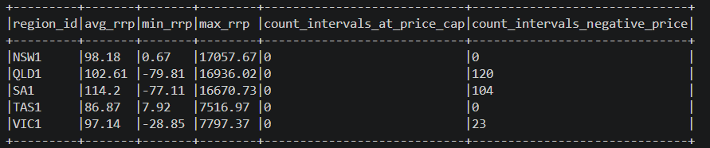
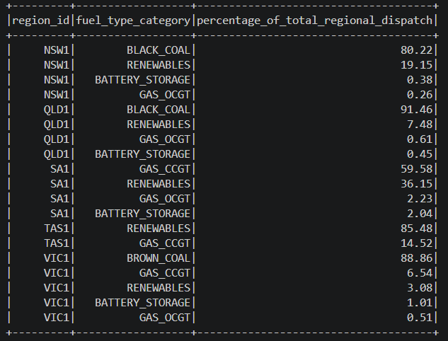
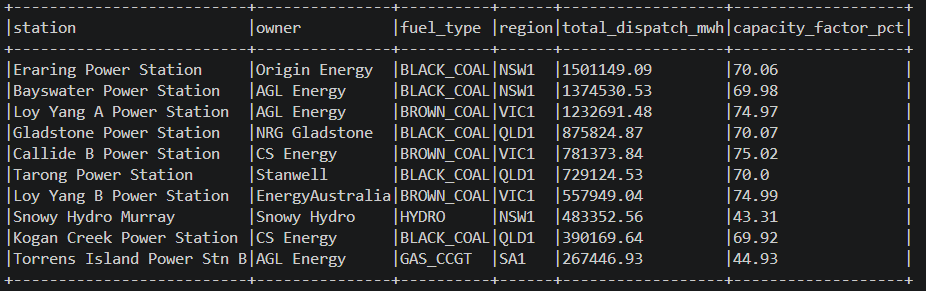

# Data Pipeline Solution – NEM Data Ingestion & Processing

## Overview
Data model and data pipeline for ingesting, transforming, and analysing Australian energy market dispatch data.
This solution leverages a modern data engineering stack consisting of:

- **Databricks**
- **Python / PySpark**
- **Azure Data Lake Storage (ADLS)**
- **Delta Lake**

The design aligns with typical Azure-based data platforms and assumes:
- Databricks is configured with a **registered Service Principal in Azure**
- Email ingestion is performed via **Microsoft Outlook**, using the **Microsoft Graph API**

Microsoft Graph API and “get” request: [Graph API](https://learn.microsoft.com/en-us/graph/api/attachment-get?view=graph-rest-1.0&tabs=http)

Azure SDK method calls: [Azure SDK](https://azuresdkdocs.z19.web.core.windows.net/python/azure-storage-file-datalake/12.21.0/index.html)

---

## Part 1 - Pipeline Architecture Summary

- To ingest daily files received via email, a scheduled Databricks Workflow job can perform a `GET` request to the **Microsoft Graph API** which will locate the email using sender + date filters and retrieve the attachments using expected file name. The attachments can then be uploaded to Azure Data Lake raw folder using Azure SDK methods.

- AEMO data on regional demand and unit dispatch data can be stored in ADLS using a **date-partitioned structure**: raw/aemo/unit_dispatch/YYYY/MM/DD/raw_unit_dispatch.csv. The partitioning will help with lifecycle management (e.g. different tiering by year) and observability. These files are ingested into a bronze delta table which has minimal change except for a derived ingestion_date column. When processing into silver, data will be cleaned and although not detected in this dataset null values may be excluded and duplicates removed. Two silver tables are joined in the materilized view unit_dispatch_enriched_mv to prevent re-execution of joins in upstream reports and queries by analysts. The cleaned silver tables are then aggregated into report-ready views in the gold layer, which can directly connect to BI reports. Daily batch processing is sufficient for this case, but if real-time ingestion is required for further analysis, then Databricks Auto Loader can be used.

- A pipeline will copy the full reference generators data into ADLS raw folder on schedule, each time overwriting the previous CSV. It is ingested into reference_generators_raw. In order to maintain a slowly chaning dimension type 2, the silver layer table will have columns "effective_from" and "effective_to". A pipeline will merge from raw, inserting new rows, closing off rows using "effective_to" and inserting new rows for updated rows, and closing off rows if some rows were deleted in the source. 

## Part 2 - Data Model

The pipeline follows a medallion architecture with bronze for raw ingestion, silver for cleaned and enriched data, and gold for report-ready aggregations. The central silver table is unit_dispatch_enriched_mv, which pre-joins the 5-minute dispatch fact (unit_dispatch_interval) with generator reference attributes (reference_generators_scd2) using a point-in-time SCD2 join — meaning every downstream gold view gets fuel type, owner, station name, and registered capacity without needing to perform any joins itself. Each of the three gold views maps directly to one report question with no additional transformation required at query time. 

**region_demand_raw** (Bronze)
- Grain: One row per (interval_datetime, region_id).
- Partitioned by derived column ingestion_date to enable efficient incremental processing. 
- interval_datetime is set as string for safer landing. 

**unit_dispatch_raw** (Bronze)
- Grain: One row per (interval_datetime, duid).
- Partitioned by derived column ingestion_date to enable efficient incremental processing to silver layer.
- interval_datetime is set as string for safer landing. 

**reference_generators_raw** (Bronze)
- Grain: One row per duid
- No partition required as it is a small reference table. 

**region_demand_interval** (Silver)
- Grain: One row per (interval_datetime, region_id).
- Partitioned by derived column dispatch_date to help with efficient querying of dispatch data.

**unit_dispatch_interval** (Silver)
- Grain: One row per (interval_datetime, duid).
- Partitioned by derived column dispatch_date to help with efficient querying of dispatch data.

**reference_generators_scd2** (Silver)
- Grain: One row per (duid, effective_from) — representing a generator's attributes for a specific time window.
- No partitioning required as it is a small reference table.
- Extra columns effective_from and effective_to are created for scd type 2. 

**unit_dispatch_enriched_mv** (Silver)
- Grain: One row per dispatched generating unit (duid) per 5-minute dispatch interval.
- No partitioning as this is a materilized view. 

**region_price_summary_v** (Gold)
- Grain: One row per NEM region, aggregated across all intervals in the query window.
- No partitioning needed — this is a small aggregated summary with at most one row per region.

**generation_mix_by_fuel_type_v** (Gold)
- Grain: One row per (region_id, fuel_type_category) — representing each fuel group's share of total regional dispatch across the full query window.
- No partitioning needed.

**top_10_generators_by_dispatch_volume_v** (Gold)
- Grain: One row per duid (generating unit), ranked by total MWh dispatched. Result is limited to top 10.
- No partitioning needed.

## Part 3 - Report Queries

### Table A: Region price summary (Gold)

Used pyspark aggregation functions on the silver table region_demand_interval to get summary statistics (average, min, max, sum). The price cap threshold of $17,500/MWh reflects the AEMO market price cap as of 2024-25.

AEMO price cap: [AEMO](https://www.aemc.gov.au/news-centre/media-releases/2024-25-market-price-cap-now-available)

### Table B: Generation mix by fuel type and region (Gold)

For aggregation using the new category 'RENEWABLES', a new column fuel_type_category was created. total_dispatch_mw was calculated by summing dispatch_mw by region and fuel_type_category. In the next step, a window function was used to get total dispatch of each region, and the number by fuel type attained in the previous step was divided by this total to get the percentage by fuel type for each region.

### Table C: Top 10 generators by volume (Gold)

For each unit, the dispatch values were summed to get the total dispatch. Then it was multiplied by 5/60 to convert the rate MW to energy MWH. The maximum possible mwh was calculated the same way but using registered_capacity_mw. Then, the capacity factor was calculated by getting the percentage of total_dispatch_mwh of max_possible_mwh. 